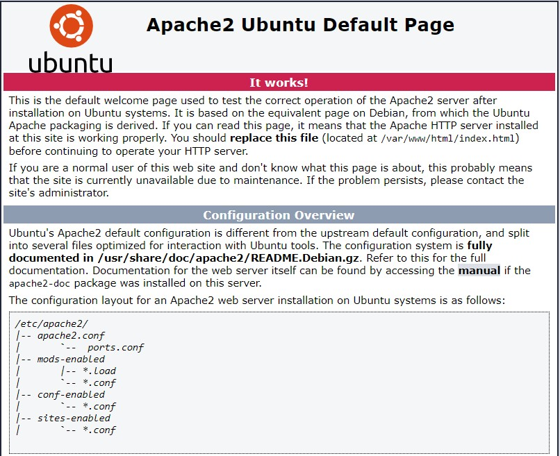
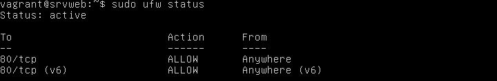
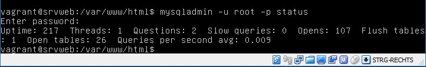

# Project Modul 300
Hier wird alles dokumentiert.

# Vagrant
## Was ist Vagrant?

Vagrant ist eine Software zum Verwalten von virtuellen Maschinen.</ps>

## Virtuelle Maschine über Vagrant erstellen

Verzeichnis lokal auf dem PC erstellen und ein Vagrant File erstellen. Anschliessend Bash öffnen und folgende Befehle im Shell eingeben 

        mkdir ubuntu
        cd ubuntu
        vagrant init ubuntu/xenial64
        vagrant up --provider virtualbox

## Befehle für Vagrant

    vagrant up --> Startet die VM
    vagrant destroy --> VM wird zerstört
    vagrant reload --> Änderungen werden vorgezogen

# Bash und Git
## Was ist Bash und Git ?

Bash ist eine Shell. Bash wird Verwendet zur Ausführung von Shellscripts und zum Einloggen auf Virtuellen Maschinen. 
Git ist eine Software zur verteilten Versionsverwaltung von Dateien.

## Repository von GitHub klonen

Shell starten

    git config --global user.name "<username>"
    git config --global user.email "<mail>"
    git clone link

# Virtualbox
## Was ist Virtualbox

Virtualbox ist eine Software, die erlaubt lokal auf dem PC virtuellen Maschinen zu erstellen und zu verwalten.

# Visual Studio Code
## Was ist Visual Studio Code ?

Visual Studio Code ist ein Source Code Editor.

## Einstellungen für Visual Studio Code

    // Der Pfad zur ausführbaren Git-Datei.
    "git.path": "C:\\Program Files\\Git\\bin\\git.exe",
    // Passt an, welches Terminal für Windows ausgeführt werden soll.
    "terminal.external.windowsExec": "C:\\Program Files\\Git\\git-bash.exe",
    // Der Pfad der Shell, den das Terminal unter Windows verwendet.
    "terminal.integrated.shell.windows": "C:\\Program Files\\Git\\git-bash.exe",
    // Konfiguriert die Globmuster zum Ausschließen von Dateien und Ordnern.
    "files.exclude": {
        "**/.git": true,
        "**/.svn": true,
        "**/.hg": true,
        "**/.vagrant": true,
        "**/.DS_Store": true
    },

# Apache

## Was ist Apache ?

Apache wird verwendet um einen Webserver zu betreiben.

## Einstellungen für Apache

Port Forwarding --> VM Hülle

    
    config.vm.network "forwarded_port", guest: 80, host: 8080

Apache installieren und testen

    sudo apt-get install apache2 -y
    Browser öffnen --> URL: localhost:8080

# Firewall

## Was ist eine Firewall ?

 Eine Firewall schützt das lokale Netzwerk von unerlaubten Netzwerkzugriffe.

## Firewall installieren

    sudo apt-get install ufw --> UFW installieren
    sudo ufw status --> Firewall Status anzeigen
    sudo ufw enable --> Firewall aktivieren
    sudo ufw disable --> Firewall deaktivieren

## Meine Firewall Regeln

    # Port 80 (HTTP) öffnen für alle
    sudo ufw allow 80/tcp
    sudo ufw -f enable
    exit

    # Port 22 (SSH) nur für den Host öffnen
    sudo ufw allow from 10.0.2.15 to any port 22
    exit

    # Port 3306 (MySQL) nur für den web Server öffnen
    vagrant ssh database
    sudo ufw allow from localhost:3306 to any port 3306
    sexit

## Firewall Testen

    curl -f 10.0.2.15 --> HTML Code sollte angezeigt werden
    curl -f localhost:3306 --> MySQL
    sudo ufw status --> Aktive Firewallregeln
    

# MySQL

## Was ist MySQl ?

MySQL ist eine Datenbank

## MySQL Konfig Passwort setzen

    debconf-set-selections <<< 'mysql-server mysql-server/root_password password vagrant'
    debconf-set-selections <<< 'mysql-server mysql-server/root_password_again password vagrant'

## MySQL installieren

    sudo apt-get install mysql-server -y

## MySQL Testen

    mysqladmin -u root -p status --> MySQL Login

# Docker

## Was ist Docker ?

Die Docker-Plattform besteht vereinfacht gesagt aus zwei getrennten Komponenten: der Docker Engine, die für das Erstellen und
Ausführen von Containern verantwortlich ist, sowie dem Docker Hub, einem Cloud Service, um Container-Images zu verteilen.

    Docker Tools Installieren

## Befehle für Docker

    docker run hello-world --> Installation Überprüfen
    docker run -it ubuntu /bin/bash --> Container mit Shell
    docker run -d ubuntu sleep 20 --> Container im Hintergrund
    docker run -d ubuntu touch /tmp/lock --> Container und File erstellen
    docker ps --> Überblick über alle Containern
    docker rm <name> --> Container löschen
    docker rm `docker ps -a -q` --> Beendenten Container lösch.
    docker rm -f `docker ps -a -q` --> Auch Aktive löschen
    docker rmi ubuntu --> ISO löschen
    docker start <id> --> Gestoppte Container starten
    RAM begrenzen --> docker run -m 2096m --memory-swap 2096m

## Dockerfile einrichten und testen

1. Dockerfile im Verzeichnis erstellen

2. Image anhand vom Dockerfile erstellen

>docker build -t webserver .

## Container starten
    docker run -d -p 8080:80 webserver

    Aktive Container anzeigen --> docker ps

## Webserver Testen

 Es gibt zwei Arten um zu schauen ob der Dienst läuft

> curl http://192.168.99.100:8080

Über einem Browser

## Firewall Regeln nachschauen

    docker exec -it 0f04ee636332 bash
    ufw status

## Monitoring

Über CMD</>

>docker stats

Mit Cadvisor

    docker run -d --name cadvisor -v /:/rootfs:ro -v /var/run:/var/run:rw -v /sys:/sys:ro -v /var/lib/docker/:/var/lib/docker:ro -p 8080:8080 webserver/cadvisor

## Docker User

Mit diesem Befehl kann ein Docker user erstellt werden 

>RUN groupadd -r User_Group && useradd -r -g User_group xyz

## Mögliche Befehle für Markdown
# headers

*emphasis*

**strong**s

* list

>block quote

    code (4 spaces indent)
[links](http://wikipedia.org)

----
## changelog
* 17-Feb-2013 re-design

----
## thanks
* [markdown-js](https://github.com/evilstreak/markdown-js)
